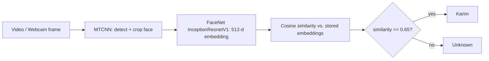

# 👤 Real-Time Face Detection & Recognition

A deep learning pipeline that detects faces, converts them into embeddings, and recognizes whether each face is **Karim** or **Unknown**, on video files and live webcam.


<!-- TODO: add a demo GIF of the webcam recognition (blur/crop out anyone else in the frame). -->

## 🧠 How it works



1. **Detection:** MTCNN finds and extracts faces from each frame.
2. **Embedding:** a FaceNet model (`InceptionResnetV1`, **pretrained on VGGFace2**) turns each face into a vector. *No model training was done here; the pretrained model is used as a feature extractor.*
3. **Database:** embeddings of my face were generated from frames of a training video and saved for later use.
4. **Matching:** cosine similarity between a new face and the stored embeddings. A **0.65 threshold** decides Karim vs. Unknown.
5. **Output:** bounding boxes, identity labels, and similarity scores drawn in real time. Uses GPU through PyTorch when available.

## ✨ Features
- Face detection and extraction with MTCNN
- Personal embedding database, saved and reloaded
- Similarity-based recognition with an adjustable threshold
- Video-file processing and live webcam recognition
- GPU acceleration when available

## 🧰 Tech stack
Python · PyTorch · facenet-pytorch · MTCNN · OpenCV · NumPy · pandas · Matplotlib

## 🚀 Getting started

```bash
git clone https://github.com/Karimmoo1/REPO-NAME.git
cd REPO-NAME
pip install -r requirements.txt
```

<!-- TODO: replace with your real commands/notebook names -->
```bash
# 1) Build the embedding database from your own video
python build_database.py --video data/train_video.mp4

# 2) Run on a video
python recognize_video.py --video data/test_video.mp4

# 3) Live webcam
python recognize_webcam.py
```

## 🎚️ Choosing the threshold
The 0.65 threshold is a trade-off: a lower value accepts more matches (more false positives), a higher value is stricter (more people wrongly marked Unknown). <!-- TODO: if you tested other values, add a short table of results here. -->

## ⚠️ Limitations
- Only one known identity; the database is built from a single training video.
- Lighting, angle, and occlusion (masks, glasses) affect similarity scores.
- Not a security-grade authentication system. It is a learning/portfolio project.

## 🔒 Privacy
Personal face images and the embeddings file are **not** included in this repo. To try it, create your own database from your own video.
<!-- TODO: make sure data/ and *.pt / *.npy embedding files are in .gitignore -->

## 🔭 Future work
- Support multiple identities
- Add a simple Streamlit demo
- Evaluate precision/recall across different thresholds
